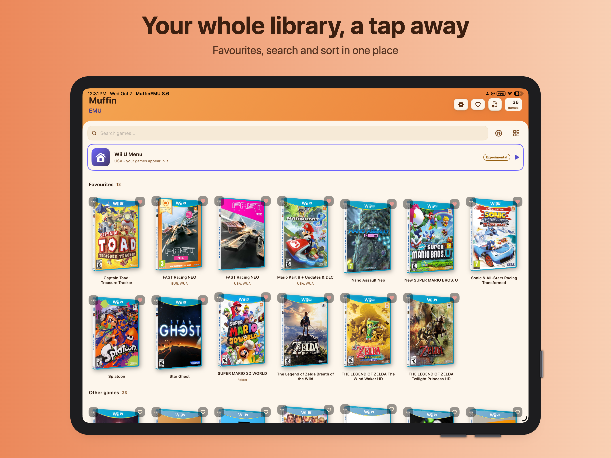
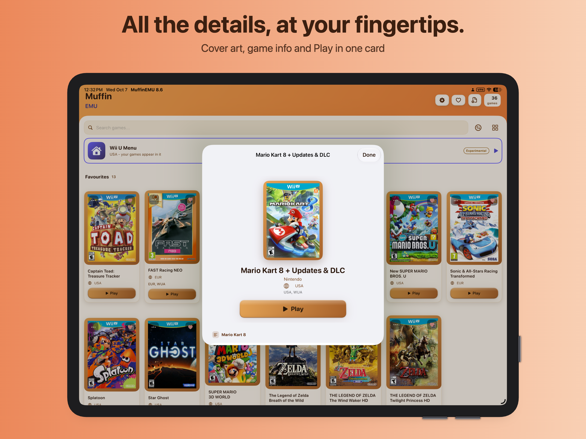
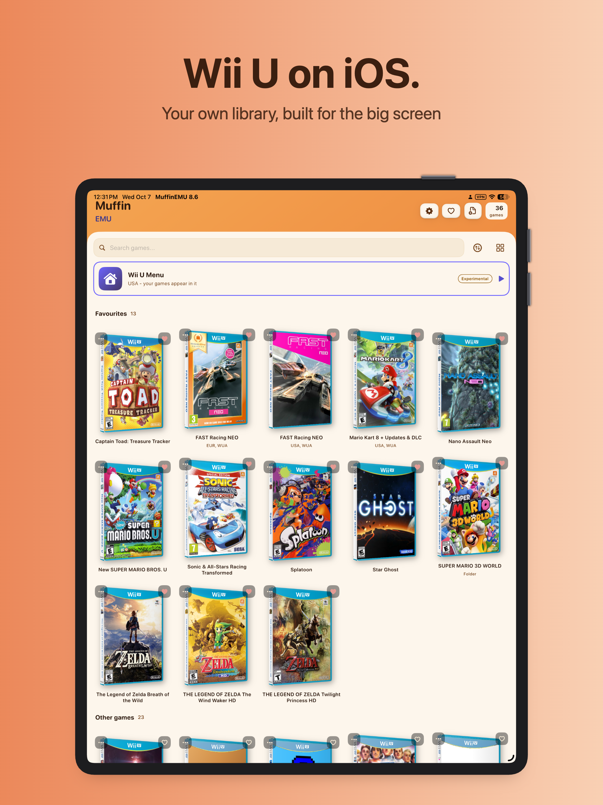

<div align="center">


# MuffinEMU

**Wii U emulation for iPhone and iPad.**

[](https://github.com/MuffinEMU/Muffin-EMU/releases/latest)
[](https://github.com/MuffinEMU/Muffin-EMU/releases)
[](https://github.com/MuffinEMU/Muffin-EMU/actions/workflows/build-ios-app.yml)
[](docs/DEVICE_SUPPORT.md)
[](LICENSE.txt)

[](https://muffinemu.github.io/MuffinEMU/docs/installation.html)
[](https://muffinemu.github.io/MuffinEMU/)

**Official website: [MuffinEMU.github.io/MuffinEMU](https://muffinemu.github.io/MuffinEMU/)**

[Install](https://muffinemu.github.io/MuffinEMU/docs/installation.html) ·
[Documentation](https://muffinemu.github.io/MuffinEMU/docs/) ·
[Releases](https://github.com/MuffinEMU/Muffin-EMU/releases) ·
[Report a bug](https://github.com/MuffinEMU/Muffin-EMU/issues/new/choose) ·
[Community stats](https://github.com/MuffinEMU/Muffin-EMU/blob/stats/STATS.md)

</div>

---

MuffinEMU (also written Muffin EMU or Muffin-EMU) is a free, open-source Wii U emulator for iPhone and iPad: a native SwiftUI app on its own Cemu-based core, with a Metal renderer, an on-screen GamePad measured from the real hardware, and JIT where iOS allows it. The official website is [MuffinEMU.github.io/MuffinEMU](https://MuffinEMU.github.io/MuffinEMU/), and this repository is its official source code and release page.

**Contents:** [Install](#install) · [Features](#features) · [Screenshots](#screenshots) · [Status](#status) · [Compatible games](#compatible-games) · [Building](#building) · [Credits](#credits)

## Install

Add the MuffinEMU source to your installer (SideStore, AltStore or LiveContainer):

```text
https://muffinemu.github.io/MuffinEMU/apps.json
```

All sources:

| Installer | Build | Source |
|---|---|---|
| SideStore, AltStore, LiveContainer | `MuffinEMU.ipa` | `https://muffinemu.github.io/MuffinEMU/apps.json` |
| TrollStore, jailbroken | `MuffinEMU-fakesigned.ipa` | `https://muffinemu.github.io/MuffinEMU/trollstore.json` |

Other sources, for people who want something other than the release known to work:

| Channel | Installer | Source |
|---|---|---|
| Nightly: the newest build of `main`, untested | SideStore, AltStore, LiveContainer | `https://muffinemu.github.io/MuffinEMU/nightly.json` |
| Nightly | TrollStore, jailbroken | `https://muffinemu.github.io/MuffinEMU/nightly-trollstore.json` |
| **Experimental, for testers:** unfinished test builds of work in progress | SideStore, AltStore, LiveContainer | `https://muffinemu.github.io/MuffinEMU/experimental.json` |
| Experimental, for testers | TrollStore, jailbroken | `https://muffinemu.github.io/MuffinEMU/experimental-trollstore.json` |

Nightly and Experimental builds replace an installed MuffinEMU (same bundle identifier, so games and saves carry over) and can misbehave. Experimental builds never appear in the Stable or Nightly sources. For normal play use the first two.

Both IPAs are attached to every [release](https://github.com/MuffinEMU/Muffin-EMU/releases). The [installation guide](https://muffinemu.github.io/MuffinEMU/docs/installation.html) explains which one to pick, how to turn on JIT, and where `keys.txt` goes.

**Games and keys are not included.** MuffinEMU plays games you have dumped from your own Wii U, and encrypted games need the `keys.txt` from that console.

**JIT.** The recompiler needs a JIT enabler (StikDebug/StikJIT, SideStore or LiveContainer) and *Use the recompiler (JIT)* switched on in Settings. Without both, MuffinEMU runs the interpreter, and Settings shows which one the current launch is using and why.

## Features

| Feature | What you get |
|---|---|
| **Library** | Import games from Files, with cover art, sorting and per-game settings. |
| **Game formats** | WUA, decrypted games, encrypted disc images with your own `keys.txt`, and encrypted game folders (`title.tmd`, `title.tik` and `.app` files, with optional update and DLC subfolders). DLC and updates install from the app. |
| **Renderers** | Metal by default. Vulkan through MoltenVK, with a choice of MoltenVK 1.4.3 or 1.2.8. |
| **CPU** | A multi-core interpreter out of the box, and the AArch64 recompiler when a JIT enabler is attached. |
| **On-screen GamePad** | Laid out from measurements of a real Wii U GamePad, with an optional analog stick, comfort controls, skins and a per-control layout editor. Four more control styles (Zone, Float, Adaptive and Frame) can be chosen in Settings, and the original stays the default. MFi and Bluetooth controllers work alongside it. |
| **Displays** | Single screen, both screens, or the TV image on an external display. |
| **Extras** | Graphic packs, save transfer, a persistent shader cache, and an in-app launch log for troubleshooting. |
| **Themes** | 31 app icons, each with a matching theme. |

## Screenshots

<p align="center">
  
  
</p>
<p align="center">
  
</p>

## Status

MuffinEMU is under active development and releases often. Expect some games not to boot or to run slowly.

> [!WARNING]
> **Known issues**
>
> - **On-screen controls** — the default on-screen controls don't respond reliably yet. A fix is on the way. Until then, we recommend using one of our other on-screen controller layout options.
> - **Vulkan** — on A12Z-class iPads the Vulkan renderer fails to find a suitable GPU. Use Metal, the default.
> - **Older GPUs** — devices without mesh shader support (A12Z and earlier) draw geometry-shader and RECTS effects with a compute-based fallback instead of skipping them. It is new, so report any effect that still looks wrong or missing.

## Compatible games

See [COMPATIBILITY.md](COMPATIBILITY.md) for games that have been verified working on certain devices running MuffinEMU.

## Building

The CI workflow ([`build-ios-app.yml`](.github/workflows/build-ios-app.yml)) is the reference build and publishes every release. To build by hand on a Mac with Xcode, CMake, Ninja and XcodeGen:

<details>
<summary>Show the build commands</summary>

```sh
git clone --recursive https://github.com/MuffinEMU/Muffin-EMU.git
cd Muffin-EMU
cmake -S . -B build-ios -G Ninja \
  -DCMAKE_SYSTEM_NAME=iOS -DCMAKE_OSX_SYSROOT=iphoneos -DCMAKE_OSX_ARCHITECTURES=arm64 \
  -DCMAKE_OSX_DEPLOYMENT_TARGET=15.0 -DVCPKG_TARGET_TRIPLET=arm64-ios \
  -DBUILD_HEADLESS_DYLIB=ON -DCMAKE_MACOSX_BUNDLE=OFF -DCMAKE_BUILD_TYPE=Release
cmake --build build-ios --target CemuBin
mkdir -p build-ios/out && cp -R "$(find build-ios bin -type d -name Cemu.framework -not -path '*/CMakeFiles/*' | head -n1)" build-ios/out/
cd src/ios && xcodegen generate
xcodebuild -project MuffinEMU.xcodeproj -scheme MuffinEMU -sdk iphoneos -configuration Release CODE_SIGNING_ALLOWED=NO build
```

</details>

## Credits

MuffinEMU is created by Void. It's built on [Cemu](https://github.com/cemu-project/Cemu) by the Cemu team.
